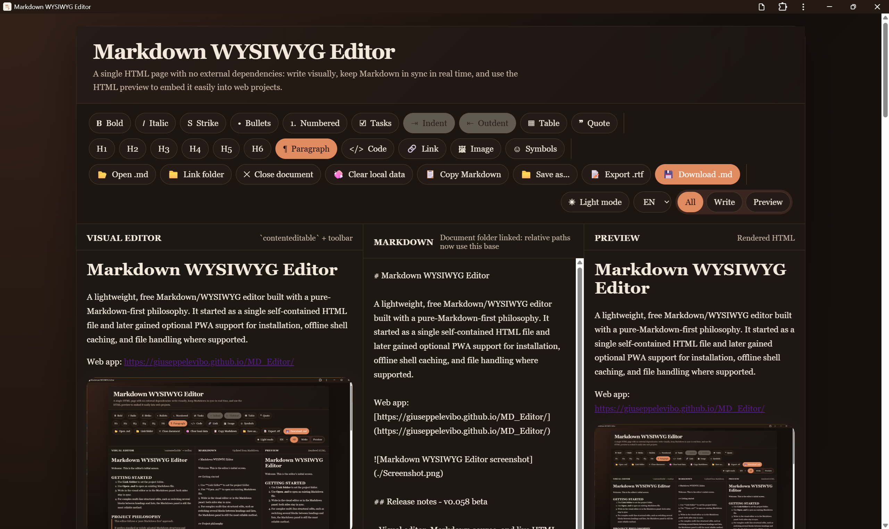

# Markdown WYSIWYG Editor

A lightweight, free Markdown/WYSIWYG editor built with a pure-Markdown-first philosophy. It started as a single self-contained HTML file and later gained optional PWA support for installation, offline shell caching, and file handling where supported.

Web app: [https://giuseppelevibo.github.io/MD_Editor/](https://giuseppelevibo.github.io/MD_Editor/)

## Release notes - v0.051 beta

- Visual editor, Markdown source, and live HTML preview kept in sync for everyday writing
- Open, edit, save, and download `.md` files
- Validated drag-and-drop opening with the same safety checks as `Open .md`
- Project-folder linking for relative images and local Markdown links
- Installable PWA shell with desktop-style usage on supported Chromium browsers
- Italian/English UI, dark mode, symbol picker, mobile mode, and privacy-oriented local reset
- Close-warning protection when the current document has unsaved changes

This is a stabilization beta focused on simplicity, portability, and standard Markdown. For complex structural edits across multiple selected lines, the Markdown panel is still the most reliable editing surface.

## Features

- Visual editor, Markdown source, and live HTML preview
- Single-page app with no runtime dependencies
- Pure-Markdown-first editing with common standard structures
- Visual nested-list editing with indent/outdent controls
- Open and edit `.md` files
- Link a project folder to resolve relative images and local assets
- Insert uploaded images directly into Markdown
- Special symbols and emoji picker
- Italian and English interface
- Installable PWA shell on supported browsers

## Recommended workflow for Markdown files with local images

1. Click `Link folder`.
2. Select the project folder or the folder that contains the Markdown file.
3. Click `Open .md`.
4. Open the Markdown document you want to edit.

If the browser supports it, the file picker will try to reopen from the linked folder.

## Notes about `Documents`

Some browsers treat special system folders such as `Documents` differently from normal folders.

- Opening and saving files in `Documents` may work.
- Linking `Documents` itself as a project folder may be blocked by the browser.
- Subfolders inside `Documents` usually work correctly and are the recommended choice.

This behavior comes from browser security rules, not from the editor itself.

## Privacy reset

`Clear local data` removes:

- the current draft stored in the browser
- saved interface preferences such as language and view mode
- local editor state for the current workstation/browser profile

It does not delete the original Markdown files on disk, inside the project folder, or on a USB drive.

## PWA support

The repository includes:

- `manifest.json`
- `sw.js`
- SVG icons for the installed app shell

File Handling API support depends on the browser and operating system. Chromium-based browsers generally offer the best support, especially after the app is installed.

## Current note about complex visual formatting

The visual editor is reliable for normal writing, inline formatting, lists, links, images, and common block changes.

For complex structural changes across multiple selected lines, especially when switching between headings and lists, the Markdown panel is currently the most reliable editing surface.

## Keyboard shortcuts

These shortcuts apply to the visual editor on desktop systems.

- `Ctrl/Cmd + B`: bold
- `Ctrl/Cmd + I`: italic
- `Ctrl/Cmd + Shift + E`: strikethrough
- `Ctrl/Cmd + U`: unordered list
- `Ctrl/Cmd + O`: ordered list
- `Ctrl/Cmd + 0`: paragraph
- `Ctrl/Cmd + 1`: heading 1
- `Ctrl/Cmd + 2`: heading 2
- `Ctrl/Cmd + 3`: heading 3
- `Ctrl/Cmd + 9`: blockquote
- `Ctrl/Cmd + S`: save the Markdown document with the Save As dialog
- `Ctrl/Cmd + P`: open a printable rendered preview in a separate window

## Development

This project is intentionally simple and easy to inspect. Most of the application still lives in `index.html`, with a small set of extra files required by the PWA layer.
