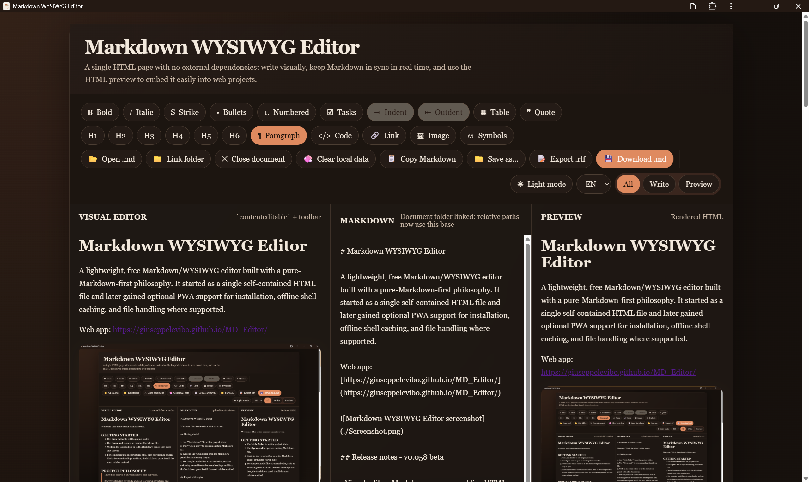

# Markdown WYSIWYG Editor

A lightweight, free Markdown/WYSIWYG editor built with a pure-Markdown-first philosophy. It started as a single self-contained HTML file and later gained optional PWA support for installation, offline shell caching, and file handling where supported.

Web app: [https://giuseppelevibo.github.io/MD_Editor/](https://giuseppelevibo.github.io/MD_Editor/)

## Release notes - v0.64.0

- Markdown is now parsed with the vendored [markdown-it](https://github.com/markdown-it/markdown-it) engine (CommonMark + GitHub tables and strikethrough), so files render like they do on GitHub or in VS Code: multi-line paragraphs, `_emphasis_` / `__strong__`, backslash escapes, setext headings, `~~~` fences, indented code, code blocks inside list items, lists nested with 4 spaces or tabs, link titles, autolinks, URLs with `&` or parentheses
- Footnotes (`[^1]`), GitHub alerts (`> [!NOTE]`), YAML front matter, and HTML entities
- Raw HTML in Markdown documents (`
`, ` `, ``, `<kbd>`, ``, ...) is rendered after DOMPurify sanitization; unsafe tags such as `<script>` stay visible as text, and non-Markdown files keep showing their markup as text
- Visual edits no longer rewrite the whole document: untouched blocks keep their exact Markdown source, and toggling a task checkbox only flips its `[ ]` / `[x]` marker
- Nested lists under numbered items are saved with CommonMark indentation (3 spaces under `1.`); older files with 2-space nesting still render nested
- Mermaid diagrams keep their arrowheads in preview-only mode, and invalid diagrams no longer leave error graphics at the bottom of the page
- UTF-16 (with BOM) and legacy Windows-1252 files open correctly; files with Windows line endings no longer look modified right after opening and are saved back with CRLF
- Relative image paths with `%20`-style escapes resolve, and Markdown files opened from a subfolder of the linked folder resolve their own relative images
- In-document links written for GitHub-style anchors (accents kept, `---` for ` - `) scroll to the matching heading

## Release notes - v0.63.5

- Visual editor, Markdown source, and live HTML preview kept in sync for everyday writing
- Desktop view modes now include paired writing, visual-only, Markdown-only, preview-only, and full workspace layouts
- Full, paired, and single-pane writing modes can transfer the caret between Visual editor and Markdown at the matching document position
- Open, edit, save, and download `.md` files
- Open readable text files such as `.txt`, `.json`, `.yaml`, `.csv`, `.log`, and source files
- Show document name, clean/modified state, length, and caret position in the PWA window title
- Validated drag-and-drop opening with the same safety checks as `Open .md`
- Project-folder linking for relative images and local Markdown links
- In-document index links scroll to their matching heading instead of opening a blank document
- Inline and display LaTeX math rendering through vendored KaTeX assets, with both `$...$` / `$$...$$` and `\(...\)` / `\[...\]` delimiters
- Mermaid graph rendering for fenced `mermaid` blocks in the visual editor and live preview
- Syntax highlighting for fenced code blocks in the visual editor, live preview, and browser print/PDF output
- Editable `RTF` export for Word/LibreOffice workflows
- Installable PWA shell with desktop-style usage on supported Chromium browsers
- Italian/English UI, dark mode, symbol picker, mobile mode, and privacy-oriented local reset
- Close-warning protection when the current document has unsaved changes

This is a stabilization beta focused on simplicity, portability, and common Markdown structures. For complex structural edits across multiple selected lines, the Markdown panel is still the most reliable editing surface.

## Features

- Visual editor, Markdown source, and live HTML preview
- Static app with vendored runtime assets for offline Markdown parsing, HTML sanitization, math, Mermaid graphs, and syntax highlighting
- CommonMark/GitHub-flavored Markdown rendering through markdown-it, with footnotes, alerts, front matter, and sanitized raw HTML
- Source-preserving visual editing: only the blocks edited in the visual editor are re-serialized
- Visual nested-list editing with indent/outdent controls
- Render LaTeX math written as `$inline$`, `$$display$$`, `\(inline\)`, or `\[display\]`
- Render Mermaid graphs written in fenced `mermaid` code blocks
- Highlight fenced code blocks with explicit languages such as `js`, `ts`, `html`, `css`, `json`, `python`, `bash`, and `markdown`
- Open and edit `.md` files
- Link a project folder to resolve relative images and local assets
- Insert uploaded images directly into Markdown
- Special symbols and emoji picker
- Italian and English interface
- Installable PWA shell on supported browsers

## Recommended workflow for Markdown files with local images

1. Click `Link folder`.
2. Select the project folder or the folder that contains the Markdown file.
3. Click `Open .md`.
4. Open the Markdown document you want to edit.

If the browser supports it, the file picker will try to reopen from the linked folder.

## RTF export notes

The editor can export the current rendered document as an editable `.rtf` file for Word-compatible word processors.

- Text structure is preserved: headings, paragraphs, lists, tables, links, blockquotes, and code blocks.
- LaTeX math is rendered in the browser view and therefore in browser print/PDF output. `RTF` export preserves the original LaTeX source as editable monospace text, not as native Word equations.
- Syntax highlighting is preserved in the browser-rendered view and therefore in browser print/PDF output. `RTF` export intentionally keeps code blocks as plain monospace text without token colors.
- Safe bitmap images are embedded when available: `PNG`, `JPEG`, and `GIF`.
- `SVG` images are currently not embedded in the `RTF` output.
- This is intentional for now: bitmap embedding is stable, while `SVG` would require an extra rendering/conversion step that goes beyond the current single-file safety model.

So if an `SVG` image is not embedded in the exported `RTF`, that is currently a supported limitation rather than a broken export.

## Notes about `Documents`

Some browsers treat special system folders such as `Documents` differently from normal folders.

- Opening and saving files in `Documents` may work.
- Linking `Documents` itself as a project folder may be blocked by the browser.
- Subfolders inside `Documents` usually work correctly and are the recommended choice.

This behavior comes from browser security rules, not from the editor itself.

## Privacy reset

`Clear local data` removes:

- the current draft stored in the browser
- saved interface preferences such as language and view mode
- local editor state for the current workstation/browser profile

It does not delete the original Markdown files on disk, inside the project folder, or on a USB drive.

## PWA support

The repository includes:

- `manifest.json`
- `sw.js`
- SVG icons for the installed app shell
- vendored KaTeX CSS, JS, and fonts for offline LaTeX math rendering
- vendored PrismJS CSS and language components for offline syntax highlighting
- vendored markdown-it (with the footnote plugin) and DOMPurify for offline Markdown parsing and HTML sanitization

File Handling API support depends on the browser and operating system. Chromium-based browsers generally offer the best support, especially after the app is installed.

## Current note about complex visual formatting

The visual editor is reliable for normal writing, inline formatting, lists, links, images, and common block changes.

For complex structural changes across multiple selected lines, especially when switching between headings and lists, the Markdown panel is currently the most reliable editing surface.

## Keyboard shortcuts

These shortcuts apply to the visual editor on desktop systems.

- `Ctrl/Cmd + B`: bold
- `Ctrl/Cmd + I`: italic
- `Ctrl/Cmd + Shift + E`: strikethrough
- `Ctrl/Cmd + U`: unordered list
- `Ctrl/Cmd + O`: ordered list
- `Ctrl/Cmd + 0`: paragraph
- `Ctrl/Cmd + 1`: heading 1
- `Ctrl/Cmd + 2`: heading 2
- `Ctrl/Cmd + 3`: heading 3
- `Ctrl/Cmd + 9`: blockquote
- `Ctrl/Cmd + S`: download or save the Markdown document
- `Ctrl/Cmd + Shift + S`: save a copy with a new name or location
- `Ctrl/Cmd + P`: open a printable rendered preview in a separate window

## Development

This project is intentionally simple and easy to inspect. Most of the application still lives in `index.html`, with a small set of extra files required by the PWA layer.
