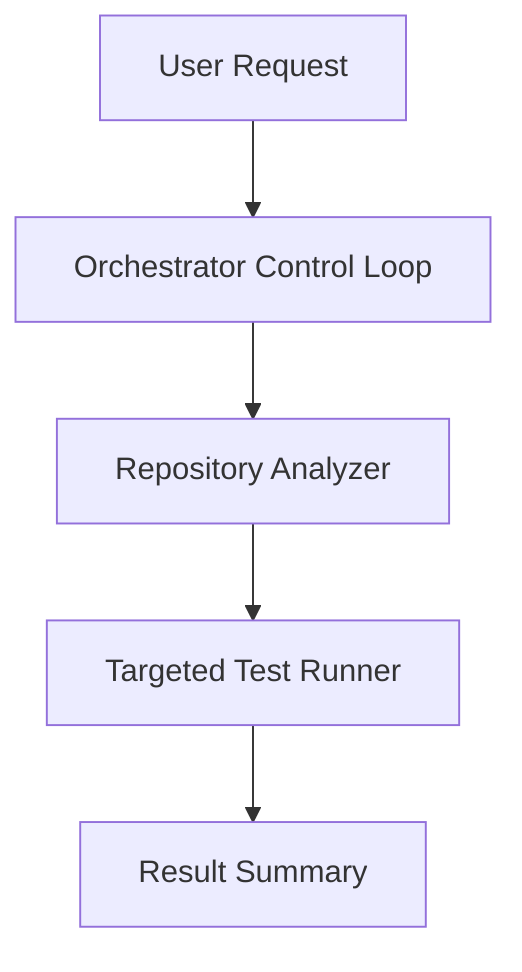

# Project Structure Analysis

The orchestration flow below is a compact fixture for Mermaid rendering tests.

```mermaid
graph TD
    UserRequest["User Request"] --> Orchestrator["Orchestrator Control Loop"]
    Orchestrator --> Analyzer["Repository Analyzer"]
    Analyzer --> TestRunner["Targeted Test Runner"]
    TestRunner --> Report["Result Summary"]
```
